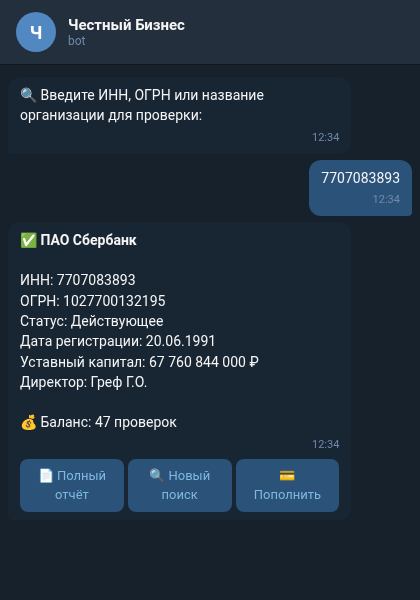

<div align="center">

# tg-zachestny-bot

**Бот для проверки контрагентов в Telegram**


</div>

Telegram-бот для проверки юридических лиц, физических лиц и индивидуальных предпринимателей через API zachestnyibiznes.ru. Работает как розничный фронтенд над API — каждая проверка является отдельным платным заказом: пользователь оплачивает проверку через YooKassa, затем вводит запрос и получает отформатированный отчёт. Включает инструменты администратора для статистики, просмотра пользователей и рассылок. Абстракции провайдеров поставляются с мок-данными, поэтому бот работает от начала до конца без реальных API или платёжных реквизитов.

## ■ Возможности

- ❖ **Проверка юридических лиц** — проверка юридических лиц (ЮЛ) по свободному запросу (ИНН, ОГРН или название)
- ❖ **Проверка физических лиц** — проверка физических лиц (ФЛ) по имени + дате рождения или данным документа
- ❖ **Проверка индивидуальных предпринимателей** — проверка индивидуальных предпринимателей (ИП) по ИНН или ОГРНИП
- ❖ **Оплата за проверку** — один платёж YooKassa за проверку; данные вводятся только после подтверждения оплаты
- ❖ **История проверок** — журнал прошлых проверок на каждого пользователя с полным повторным отображением результата
- ❖ **Настраиваемые цены** — отдельная цена за каждый тип проверки (ЮЛ / ФЛ / ИП)
- ❖ **Инструменты администратора** — статистика использования (день/неделя/месяц), список пользователей с постраничной навигацией, рассылка, бесплатные проверки для администраторов
- ❖ **Сменяемые провайдеры** — абстрактные интерфейсы API и платежей с мок-реализациями, готовые к замене на реальные
- ❖ **Интеграция с YooKassa** — создание платежей, приёмник вебхуков aiohttp и резервный опрос статуса

## ■ Стек

<div align="center">

| Компонент | Технология |
|-----------|------------|
| Бот | Python (aiogram 3.x) |
| Асинхронный HTTP / вебхуки | aiohttp |
| База данных | SQLite (aiosqlite) |
| Платежи | YooKassa SDK |
| API данных | zachestnyibiznes.ru |
| Конфигурация | pydantic-settings (.env) |

</div>

## ■ Как это работает

```
1. Пользователь выбирает тип проверки — юридическое лицо (ЮЛ), физическое лицо (ФЛ) или индивидуальный предприниматель (ИП)
2. Бот создаёт платёж YooKassa на соответствующую сумму; пользователь оплачивает внутри Telegram
3. После подтверждения оплаты (вебхук или резервный опрос статуса) бот запрашивает у пользователя данные для поиска
4. Бот передаёт запрос в API zachestnyibiznes.ru и форматирует ответ
5. Отформатированный отчёт доставляется пользователю и сохраняется в его истории проверок для повторного отображения
```

## ■ Скриншоты

<div align="center">



*Основной интерфейс бота*

</div>

## ■ Использование

```bash
cd bot
make install
make run

# Настройте bot/.env (см. .env.example):
# BOT_TOKEN, ADMIN_IDS, CHECK_PRICE_UL/FL/IP,
# YOOKASSA_SHOP_ID, YOOKASSA_SECRET_KEY,
# ZACHESTNY_API_KEY, WEBHOOK_PORT
#
# Без ключей YOOKASSA_* → MockPaymentProvider (платежи отключены).
# Без ZACHESTNY_API_KEY → MockAPIClient (демо-режим).
```

## ■ Структура репозитория

```
bot/
├── main.py              # entrypoint: wires providers, runs polling + webhook server
├── config.py            # pydantic-settings config (prices, tokens, webhook)
├── texts_data.py        # all bot copy (Russian)
├── handlers/            # user, admin, payment-webhook routers
├── services/            # api_client, payment (YooKassa/mock), billing
├── database/            # SQLite schema, connection, queries
├── utils/               # keyboards, formatters, text helper
├── Makefile             # install / run targets
└── requirements.txt
```

## ■ Лицензия

MIT © [pluttan](https://github.com/pluttan)
